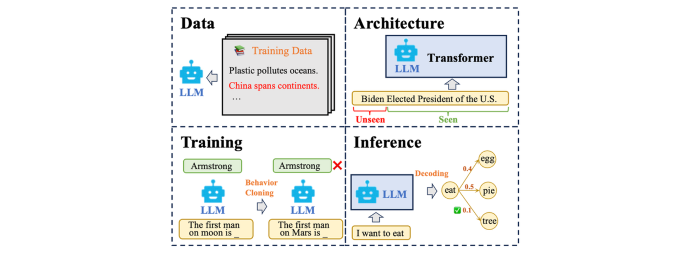
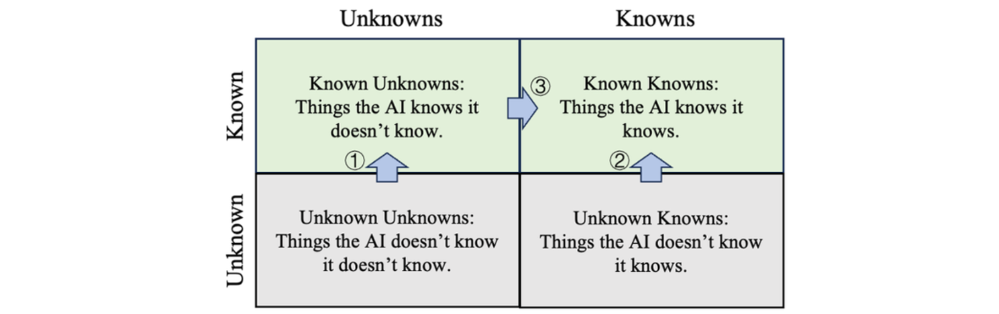

# Reliable LLM: Hallucination & Knowledge & Uncertainty

\
 

This repository, called **UR2-LLMs** contains a collection of resources and papers on **Uncertainty**, **Reliability** and **Robustness** in **Large Language Models**. 

"*Large language models have limited reliability, limited understanding, limited range, and hence need human supervision*. " - Michael Osborne, Professor of Machine Learning in the Dept. of Engineering Science, University of Oxford, January 25, 2023 

*Welcome to share your papers, thoughts and ideas in this area!* 

The project demonstrates the background and collects research works about LLM uncertainty & confidence and calibration by systematically clustering in various directions and methods for reliable AI development.

## Contents

- [Reliable LLM: Hallucination \& Knowledge \& Uncertainty](#reliable-llm-hallucination--knowledge--uncertainty)
  - [Contents](#contents)
  - [👻 Hallucination](#-hallucination)
    - [Definition](#definition)
    - [Causes](#causes)
    - [Address](#address)
  - [📓 Knowledge](#-knowledge)
    - [Related Works of LLM Knowledge](#related-works-of-llm-knowledge)
      - [Known-Unknown](#known-unknown)
  - [🔭 Uncertainty](#-uncertainty)
    - [Model Calibration on Classification Tasks](#model-calibration-on-classification-tasks)
    - [Confidence \& Uncertainty Estimation Generative Models](#confidence--uncertainty-estimation-generative-models)
    - [Related Works of Uncertainty \& Confidence \& Calibration](#related-works-of-uncertainty--confidence--calibration)
      - [Survey \& Investigation](#survey--investigation)
      - [Uncertainty Quantification](#uncertainty-quantification)
      - [Linguistic Uncertainty Expressions](#linguistic-uncertainty-expressions)
      - [Confidence Expressions Improvements](#confidence-expressions-improvements)
      - [Hallucination Detection by Uncertainty](#hallucination-detection-by-uncertainty)
      - [Factuality Improvements by Confidence](#factuality-improvements-by-confidence)
      - [Generative Model Calibration](#generative-model-calibration)
  - [Future Directions](#future-directions)

## 👻 Hallucination

### Definition

The definitions of hallucination vary and depend on specific tasks. This project focuses on hallucination issues in knowledge-intensive tasks (closed-book QA, dialogue, RAG, commonsense reasoning, translation, etc.), where hallucinations refer to the non-factual, incorrect knowledge in generations unfaithful with world knowledge.

### Causes

The causes of hallucinations vary in unfiltered incorrect statements in pertaining data, limited input length of model architecture, maximum likelihood training strategy, and diverse decoding strategies.

Architectures and input lengths, pertaining data and strategy of released LLMs are fixed. Tracing incorrect texts in substantial pertaining data is challenging. This project mainly focuses on detecting hallucinations by tracing what LLMs learn in the pertaining stage and mitigating hallucinations in fine-tuning and decoding.

### Address

Comparing open-generation tasks, knowledge-intensive tasks have specific grounding-truth reference - world knowledge. Therefore, we can estimate the knowledge boundary map of an LLM to specify what it knows. It is crucial to ensure the certainty level or honesty of LLMs to a piece of factual knowledge for hallucination detection (from grey area to green area).

## 📓 Knowledge

The above diagram can roughly and simply represent the knowledge boundary. However, in reality, like humans, for much knowledge, we exist in a state of uncertainty, rather than only in a state of knowing or not knowing. 
Moreover, maximum likelihood prediction in pertaining makes LLMs be prone to generate over-confident responses. Even if the LLM knows a fact, how to make LLMs accurately tell what they know is also important.

This adds complexity to determining the knowledge boundary, which leads to two challenging questions:

1. How to accurately **perceive (Perception)** the knowledge boundary?
    
    > (Example: Given a question, such as "What is the capital of France?", the model is required to provide its confidence level for this question.)
    > 
2. How to accurately **express (Expression)** knowledge where the boundary is somewhat vague? (Previous work U2Align is a method to enhance expressions. Current interests for the second stage “expression” also lie in “alignment” methods.)
    
    > (Example: If the confidence level for answering "Paris" to the above question is 40%, should the model refuse to answer or provide a response in this situation?)
    >

### Related Works of LLM Knowledge

#### Known-Unknown

| Title | Conference/Journal | Notes |
| ---- | ---- | ---- |
| [Knowledge of Knowledge: Exploring Known-Unknowns Uncertainty with Large Language Models](https://arxiv.org/abs/2305.13712) | prePrint | [[Link]()] |
| [Can AI Assistants Know What They Don’t Know?](https://arxiv.org/abs/2401.13275) | prePrint | [[Link](https://zhuanlan.zhihu.com/p/683994239)] |

## 🔭 Uncertainty

### Model Calibration on Classification Tasks

-  Models are prone to be **over-confident** in predictions using maximizing likelihood (MLE) training, it is crucial to identify the **confidence score or uncertainty estimation** for reliable AI applications.
-  A model is considered **well-calibrated** if the **confidence score of predictions** (SoftMax probability) are well-aligned with the **actual probability** of answers being correct.
-  **Expected Calibration Error (ECE)** and **Reliability Diagram** is used to measure the calibration performance.

Uncalibrated (left), over-confident (mid) and well-calibrated (right) models.

### Confidence & Uncertainty Estimation Generative Models

- To calibrate generative LLMs, we should quantify the **confidence & uncertainty** on generated sentences.
- Uncertainty: Categorized into **aleatoric (data) and epistemic (model)** uncertainty. Frequently measured by the entropy of the prediction to indicate the dispersion of the model prediction.
- Confidence: Generally associated with both the input and the prediction.
- The terms uncertainty and confidence are often used interchangeably.

<!-- #### Challenges

**Confidence** or **uncertainty** estimation on generative LMs poses greater challenges due to the variable sequence lengths and the inherent difficulty in aligning uncertainty in semantic space. -->

Although the knowledge boundary is important for knowledge-intensive tasks, there are no specific definitions or concepts in previous works. Current methods for estimating knowledge boundaries refer to confidence/uncertainty estimation methods including ① logit-based methods using token-level probabilities; ② prompt-based methods to make LLMs express confidence in words; ③ sampling-based methods to calculate consistency; and ④ training-based methods to learn the ability to express uncertainty. 

### Related Works of Uncertainty & Confidence & Calibration

#### Survey & Investigation

| Title | Conference/Journal | Notes |
| ---- | ---- | ---- |
| [A Survey of Confidence Estimation and Calibration in Large Language Models](https://arxiv.org/abs/2311.08298) | prePrint | [[Link]()] |
| [Uncertainty Quantification with Pre-trained Language Models: A Large-Scale Empirical Analysis](https://openreview.net/forum?id=gjeQKFxFpZ) | EMNLP 2022 | [[Link]()] |
| [Uncertainty Estimation and Quantification for LLMs: A Simple Supervised Approach](https://arxiv.org/abs/2404.15993) | prePrint | [[Link]()] |
| [Confidence Under the Hood: An Investigation into the Confidence-Probability Alignment in Large Language Models](https://arxiv.org/abs/2405.16282) | prePrint | [[Link]()] |
| [Large Language Models Must Be Taught to Know What They Don’t Know](https://arxiv.org/abs/2406.08391) | prePrint | [[Link]()] |

#### Uncertainty Quantification

| Title | Conference/Journal | Notes |
| ---- | ---- | ---- |
| [Language Models (Mostly) Know What They Know](https://arxiv.org/abs/2207.05221) | prePrint | [[Link](https://blog.csdn.net/TgqDT3gGaMdkHasLZv/article/details/128024638)] |
| [Semantic Uncertainty: Linguistic Invariances for Uncertainty Estimation in Natural Language Generation](https://openreview.net/forum?id=VD-AYtP0dve) | ICLR 2023 | [[Link](https://amourwaltz.github.io/Reliable-LLM/files/semantic%20uncertainty.pdf)] |
| [Generating with Confidence: Uncertainty Quantification for Black-box Large Language Models](https://arxiv.org/abs/2305.19187) | prePrint | [[Link]()] |
| [When Quantization Affects Confidence of Large Language Models?](https://arxiv.org/abs/2405.00632) | prePrint | [[Link]()] |
| [Can LLMs Express Their Uncertainty? An Empirical Evaluation of Confidence Elicitation in LLMs](https://arxiv.org/abs/2306.13063) | ICLR 2024 | [[Link](https://amourwaltz.github.io/Reliable-LLM//pages/docs/xiong2024can.html)] |
| [Kernel Language Entropy: Fine-grained Uncertainty Quantification for LLMs from Semantic Similarities](https://arxiv.org/abs/2405.20003) | prePrint | [[Link]()] |
| [Semantically Diverse Language Generation for Uncertainty Estimation in Language Models](https://arxiv.org/abs/2405.20003) | prePrint | [[Link]()] |
| [Uncertainty is Fragile: Manipulating Uncertainty in Large Language Models](https://www.arxiv.org/abs/2407.11282) | prePrint | [[Link](https://amourwaltz.github.io/Reliable-LLM//pages/docs/zeng2024uncertainty.html)] |

#### Linguistic Uncertainty Expressions

| Title | Conference/Journal | Notes |
| ---- | ---- | ---- |
| [Navigating the Grey Area: Expressions of Overconfidence and Uncertainty in Language Models](https://openreview.net/forum?id=fxotfo1j8T&noteId=2Sajm3fx2g) | EMNLP 2023 | [[Link]()] |
| [Teaching Models to Express Their Uncertainty in Words](https://openreview.net/forum?id=8s8K2UZGTZ) | TMLR 2022 | [[Link]()] |
| [Relying on the Unreliable: The Impact of Language Models’ Reluctance to Express Uncertainty](https://arxiv.org/abs/2401.06730) | prePrint | [[Link](https://amourwaltz.github.io/Reliable-LLM//pages/docs/zhou2024relying.html)] |
| ["I'm Not Sure, But...": Examining the Impact of Large Language Models' Uncertainty Expression on User Reliance and Trust](https://arxiv.org/abs/2405.00623) | FAccT 2024 | [[Link]()] |
| [Can Large Language Models Faithfully Express Their Intrinsic Uncertainty in Words?](https://arxiv.org/abs/2405.00623) | prePrint | [[Link]()] |

#### Confidence Expressions Improvements

This part of works focus on improving confidence expressions of LLMs in a two-stage form by 1) self-prompting LLMs to generate responses to queries and then collecting the samples to construct a dataset with specific features, and 2) fine-tuning LLMs on the collected dataset to improve the specific capability of LLMs.

| Title | Conference/Journal | Notes |
| ---- | ---- | ---- |
| [Enhancing Confidence Expression in Large Language Models Through Learning from Past Experience](https://arxiv.org/abs/2404.10315) | prePrint | [[Link](https://amourwaltz.github.io/Reliable-LLM/pages/docs/han2024enhancing.html)] |
| [Improving the Reliability of Large Language Models by Leveraging Uncertainty-Aware In-Context Learning](https://arxiv.org/abs/2310.04782) | prePrint | [[Link](https://amourwaltz.github.io/Reliable-LLM//pages/docs/yang2023improving.html)] |
| [Uncertainty in Language Models: Assessment through Rank-Calibration](https://arxiv.org/abs/2404.03163) | prePrint | [[Link](https://amourwaltz.github.io/Reliable-LLM//pages/docs/zhang2024calibrating.html)] |
| [SaySelf: Teaching LLMs to Express Confidence with Self-Reflective Rationales](https://arxiv.org/abs/2405.20974) | prePrint | [[Link](https://amourwaltz.github.io/Reliable-LLM//pages/docs/xu2024sayself.html)] |
| [Linguistic Calibration of Language Models](https://arxiv.org/abs/2404.00474) | prePrint | [[Link](https://amourwaltz.github.io/Reliable-LLM//pages/docs/band2024linguistic.html)] |
| [R-Tuning: Instructing Large Language Models to Say ‘I Don’t Know’](https://arxiv.org/pdf/2311.09677) | prePrint | [[Link](https://amourwaltz.github.io/Reliable-LLM//pages/docs/zhang2024rtuning.html)] |

#### Hallucination Detection by Uncertainty

| Title | Conference/Journal | Notes |
| ---- | ---- | ---- |
| [On Hallucination and Predictive Uncertainty in Conditional Language Generation](https://aclanthology.org/2021.eacl-main.236/) | EACL 2021 | [[Link]()] |
| [Learning Confidence for Transformer-based Neural Machine Translation](https://aclanthology.org/2022.acl-long.167.pdf) | ACL 2022 | [[Link]()] |
| [Towards Reliable Misinformation Mitigation: Generalization, Uncertainty, and GPT-4](https://openreview.net/forum?id=cCJGuKJYG8&referrer=%5Bthe%20profile%20of%20Kellin%20Pelrine%5D(%2Fprofile%3Fid%3D~Kellin_Pelrine1)) | EMNLP 2023 | [[Note](https://blog.csdn.net/qq_52053775/article/details/138184326)] |
| [SelfCheckGPT: Zero-Resource Black-Box Hallucination Detection for Generative Large Language Models](https://openreview.net/forum?id=RwzFNbJ3Ez&referrer=%5Bthe%20profile%20of%20Mark%20Gales%5D(%2Fprofile%3Fid%3D~Mark_Gales1)) | EMNLP 2023 | [[Note](https://blog.csdn.net/qq_52053775/article/details/138184326)] |
| [Detecting Hallucinations in Large Language Models using Semantic Entropy](https://www.nature.com/articles/s41586-024-07421-0) | Nature | [[Link]()] |
| [LLM Internal States Reveal Hallucination Risk Faced With a Query](https://arxiv.org/abs/2407.03282) | prePrint | [[Link]()] |

#### Factuality Improvements by Confidence

| Title | Conference/Journal | Notes |
| ---- | ---- | ---- |
| [Inference-Time Intervention: Eliciting Truthful Answers from a Language Model](https://openreview.net/forum?id=aLLuYpn83y) | NeurIPS 2023 | [[Link](https://zhuanlan.zhihu.com/p/656757564)] |
| [When to Trust LLMs: Aligning Confidence with Response Quality](https://arxiv.org/abs/2404.17287) | prePrint | [[Link](https://amourwaltz.github.io/Reliable-LLM//pages/docs/tao2024when.html)] |
| [When to Trust LLMs: Aligning Confidence with Response Quality](https://arxiv.org/abs/2404.17287) | prePrint | [[Link](https://amourwaltz.github.io/Reliable-LLM//pages/docs/tao2024when.html)] |
| [Uncertainty Aware Learning for Language Model Alignment](https://arxiv.org/abs/2406.04854) | ACL 2024 | [[Link]()] |

#### Generative Model Calibration

| Title | Conference/Journal | Notes |
| ---- | ---- | ---- |
| [Reducing Conversational Agents’ Overconfidence Through Linguistic Calibration](https://aclanthology.org/2022.tacl-1.50/) | TACL 2022 | [[Link]()] |
| [Preserving Pre-trained Features Helps Calibrate Fine-tuned Language Models](https://openreview.net/forum?id=NI7StoWHJPT) | ICLR 2023 | [[Link]()] |
| [Calibrating the Confidence of Large Language Models by Eliciting Fidelity](https://arxiv.org/abs/2404.02655) | prePrint | [[Link](https://amourwaltz.github.io/Reliable-LLM//pages/docs/zhang2024calibrating.html)] |
| [Few-Shot Recalibration of Language Models](https://arxiv.org/abs/2403.18286) | prePrint | [[Link](https://amourwaltz.github.io/Reliable-LLM/pages/docs/li2024fewshot.html)] |
| [How Can We Know When Language Models Know? On the Calibration of Language Models for Question Answering](https://aclanthology.org/2021.tacl-1.57/) | TACL 2022 | [[Link]()] |
| [Knowing More About Questions Can Help: Improving Calibration in Question Answering](https://aclanthology.org/2021.findings-acl.172.pdf) | ACL 2021 Findings | [[Link]()] |
| [Just Ask for Calibration: Strategies for Eliciting Calibrated Confidence Scores from Language Models Fine-Tuned with Human Feedback](https://aclanthology.org/2023.emnlp-main.330/) | EMNLP 2023 | [[Link]()] |
| [Re-Examining Calibration: The Case of Question Answering](https://aclanthology.org/2022.findings-emnlp.204/) | TACL 2021 | [[Link]()] |
| [Calibrating Large Language Models Using Their Generations Only](https://arxiv.org/abs/2403.05973) | prePrint | [[Link](https://amourwaltz.github.io/Reliable-LLM//pages/docs/ulmer2024calibrating.html)] |
| [Calibrating Large Language Models with Sample Consistency](https://arxiv.org/abs/2402.13904) | prePrint | [[Link]()] |
| [Linguistic Calibration of Language Models](https://arxiv.org/abs/2404.00474) | prePrint | [[Link](https://amourwaltz.github.io/Reliable-LLM//pages/docs/band2024linguistic.html)] |

## Future Directions

1. More advanced methods to assist LLMs hallucination detection and human decisions. (A new paradigm) 
2. Confidence estimation for long-term generations like code, novel, etc. (Benchmark) 
3. Learning to explain and clarify its confidence estimation and calibration. (Natural language)
4. Calibration on human variation (Misalignment between LM measures and human disagreement).
5. Confidence estimation and calibration for multi-modal LLMs.
